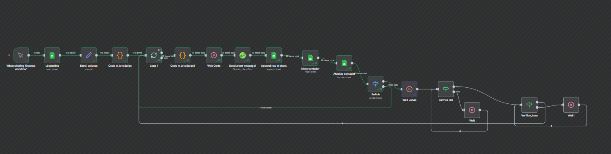

# 🤖 Projeto de Automação de Mensagens — n8n + WAHA

Este repositório documenta o fluxo automatizado desenvolvido em **n8n**, integrado ao **WAHA (WhatsApp HTTP API)** e **hospedado na AWS** utilizando **Docker**.  
O sistema realiza o envio controlado de mensagens personalizadas com base em dados de planilhas, incluindo controle de horário, dia e registros de execução.

---

## ☁️ Arquitetura do Projeto

O projeto é totalmente **containerizado** e executado em uma instância **AWS (EC2)**.  
Os serviços principais são:

- **n8n** → responsável pela automação e orquestração dos fluxos.
- **WAHA (WhatsApp HTTP API)** → responsável por enviar mensagens via WhatsApp.
- **Docker Compose** → gerencia os containers e seus volumes persistentes.
- **AWS EC2** → infraestrutura de hospedagem do ambiente.

---

## 🧩 Fluxo de Automação



### Etapas do Workflow:
## 🧩 Etapas detalhadas do Workflow

Este fluxo automatizado foi desenvolvido no **n8n** para gerenciar o contato com ex-alunos do programa **Geração Tech** de forma eficiente, organizada e segura. Cada etapa foi pensada para garantir o envio correto das mensagens, registrar informações e respeitar horários permitidos.

1. **Trigger manual**  
   O workflow inicia quando o usuário clica em **"Executar workflow"** no n8n. Este acionamento manual garante que o processo só comece quando for necessário, evitando envios acidentais ou repetidos.

2. **Leitura de planilha**  
   O sistema acessa uma planilha contendo os dados dos ex-alunos, incluindo nome, contato (WhatsApp), mensagens personalizadas e informações relevantes para o envio. Essa etapa garante que todas as informações necessárias para cada envio estejam disponíveis de forma organizada.

3. **Extração e formatação dos dados**  
   Antes de enviar as mensagens, os dados da planilha passam por uma etapa de tratamento utilizando **JavaScript**. Aqui, campos são validados, nomes e textos são ajustados e dados faltantes ou incorretos podem ser filtrados. Isso garante que a mensagem enviada seja personalizada e correta.

4. **Loop por cada contato**  
   O workflow percorre cada linha da planilha, garantindo que cada ex-aluno seja processado individualmente. Essa lógica de repetição evita que algum registro seja perdido e permite tratar cada envio separadamente.

5. **Envio de mensagem via WAHA**  
   Para cada contato, o workflow envia a mensagem personalizada utilizando a API **WAHA (WhatsApp HTTP API)**. A integração garante confiabilidade no envio e permite rastrear o status de cada mensagem.

6. **Registro do envio**  
   Após o envio, o workflow registra o resultado na planilha. Informações como "enviado" são salvas, permitindo monitoramento e auditoria do processo.

7. **Controle de contadores**  
   O sistema mantém um registro do progresso total, contabilizando quantas mensagens já foram enviadas e quantas ainda faltam. Esse controle facilita o acompanhamento em tempo real e ajuda a gerenciar grandes volumes de envio.

8. **Validação de horário e dia**  
   Antes de cada envio, o workflow verifica se a mensagem está sendo enviada dentro do horário definido. Essa validação impede que mensagens sejam enviadas fora do horário comercial ou em dias não autorizados, respeitando regras de comunicação e boas práticas do WhatsApp.

9. **Delays (Wait)**  
   Para evitar bloqueios ou problemas de spam no WhatsApp, o workflow adiciona pausas automáticas entre cada envio. Esses delays garantem que o volume de mensagens seja distribuído ao longo do tempo, mantendo o fluxo seguro e eficiente.


---

## 🧱 Estrutura de Arquivos


## 🧱 Estrutura de Arquivos
```
├── README.md 
├── docker/ 
│ ├── Dockerfile 
│ └── docker-compose.yaml 
├── .env.sample 
├── n8n.json 
├── fluxo-n8n.png 
```

---

## ⚙️ Ambiente de Execução

| Recurso | Descrição |
|----------|------------|
| **Plataforma** | AWS EC2 (Ubuntu) |
| **Orquestração** | Docker Compose |
| **Containers** | n8n + WAHA |
| **Porta WAHA** | 3000 (localhost) |
| **Rede Docker** | rede-projeto-gabi |

---

## 🧠 Objetivo

Automatizar o envio de mensagens de WhatsApp de forma escalável, rastreável e dentro de horários controlados.  
O fluxo garante:
- Redução de erros manuais no envio;
- Controle de horários e dias de operação;
- Logs e histórico de execução em planilha;
- Persistência de sessões e mídias via Docker.

---

## 🔒 Segurança e Manutenção

- O acesso à instância AWS é restrito via SSH.
- Credenciais sensíveis estão armazenadas no arquivo `.env` (não versionado).
- Atualizações da imagem WAHA podem ser aplicadas com:

  ```bash
  docker compose pull && docker compose up -d

